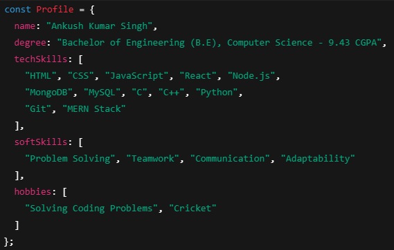

<h1 align="left">Hi 👋, I'm Ankush Kumar Singh</h1>
<h2 align="left">A passionate Software Engineer and Developer 🇮🇳</h2>

<!-- Full-width Centered Banner Image -->

  

<h3 align="left">🛠️ Tools & Technologies</h3>

<!-- Section Headings in a single line -->

  <strong>Programming Languages</strong>&emsp;&emsp;&emsp;&emsp;&emsp;&emsp;
  <strong>Frontend</strong>&emsp;&emsp;&emsp;&emsp;&emsp;&emsp;&emsp;&emsp;
  <strong>Backend</strong>&emsp;&emsp;&emsp;&emsp;&emsp;&emsp;&emsp;
  <strong>Databases</strong>

<!-- All icons in one line -->

  <!-- Programming Languages -->
  &emsp;
  
  
  
  &emsp;&emsp;&emsp;

  <!-- Frontend -->
  
  
  
  
  &emsp;&emsp;&emsp;&emsp;

  <!-- Backend -->
   
  
  &emsp;&emsp;&emsp;&emsp;

  <!-- Databases -->
  
  

  &nbsp;&nbsp;

 

<!-- 📫 Contact & GitHub Info -->
<h3 align="left">📫 Contact & GitHub Info</h3>

<!-- Connect with Me -->

  <strong>Connect with Me:</strong> 
  
  &nbsp;&nbsp;
  
  &nbsp;&nbsp;
  

  &nbsp;&nbsp;
<!-- GitHub Top Languages -->

  <strong>Top Languages:</strong> 
  

<!-- GitHub Stats -->

  <strong>GitHub Stats:</strong> 
  

<!-- Visitor Count -->

  <strong>Visitor Count:</strong> 
  

 

